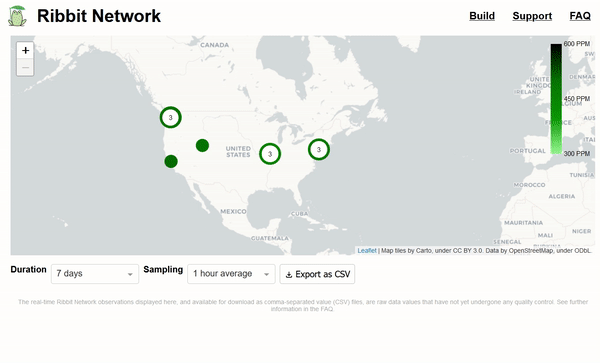

# Interpretation and analysis of Ribbit Network observations

This repository contains instructions for accessing Ribbit Network data, and example jupyter notebooks for reading, plotting, interpreting, and performing analysis on the data using python and common python packages[^1].

---

### Geting started

Install mamba (or your favorite package manager for python)

https://github.com/conda-forge/miniforge#mambaforge

Set up your environment

```mamba create --name ribbit-data-env scipy numpy pandas matplotlib ipykernel jupyter ipympl```

Activate the environment

```mamba activate ribbit-data-env```

Add environment to ipython for use in jupyter notebooks

```ipython kernel install --user --name=ribbit-data-env```

Launch jupyter notebook

```jupyter notebook```

---

### Download Ribbit Network data

Ribbit Network data are currently available through the real-time [data dashboard](https://dashboard.ribbitnetwork.org/).

Data can be downloaded by selecting the sensor of interest on the map, then from the dropdown menus select the duration (up to 30 days) and sampling interval (from 1 minute raw samples to 1 hour averages), then click "Export as CSV" to begin the download.

[](https://dashboard.ribbitnetwork.org/)

---

[^1]: The jupyter notebooks in this repo are based in part on material from the Data Analysis for Water Science course at the University of Washington ([current version here](https://mountain-hydrology-research-group.github.io/data-analysis/), and [2020 version here](https://spestana.github.io/data-analysis/)).


